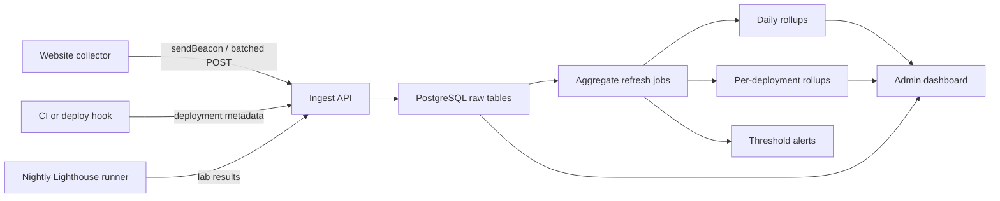

# MVP Specification

## Product Statement

Build a multi-site performance observability hub that combines:

- field data from real users
- lab data from scheduled Lighthouse runs
- release metadata from deploy pipelines

The first version should help a small team answer performance questions without guesswork.

## What The MVP Must Do

- ingest Web Vitals events from multiple sites
- store raw events with attribution details
- compute p75 by day, site, page group, device, and release
- compare metrics before and after a deploy
- display daily trends and current failures for LCP, INP, and CLS
- attach nightly Lighthouse evidence for critical URLs

## Non-Goals For V1

- full session replay
- per-user diagnostics tooling
- custom anomaly detection models
- distributed stream processing
- SLO automation across every metric category

## Core Model

- `team`
- `site`
- `site_domain`
- `deployment`
- `page_group`
- `vitals_event`
- `synthetic_run`

## Architecture

## Data Flow

### 1. Collector

Each managed site loads a tiny collector bundle.
The collector:

- reads deployment metadata injected into the page
- groups the current path into a `page_group`
- captures Web Vitals using attribution mode
- batches events and sends them with `navigator.sendBeacon`

Required release context on every event:

- `site_key`
- `environment`
- `build_id`
- `release_version`
- `git_ref`

### 2. Storage And Aggregation

The ingest API writes raw rows into `vitals_events` and `synthetic_runs`.
Each raw row should duplicate `build_id` and `page_group_key` even when relational links exist.
That keeps release compare and rollups stable if deployments or page-group mappings are created late.

Aggregation runs on a schedule:

- every 15 minutes for fresh dashboards
- nightly for backfill and rollup correction

The first two materialized views should be:

- `daily_metric_rollups`
- `deployment_metric_rollups`

### 3. Dashboard And Alert

The admin app should answer three questions quickly:

1. Which sites are unhealthy today
2. Which page groups or device segments are causing it
3. Which deployment most likely introduced the regression

## Page Group Strategy

Do not treat every URL as its own reporting slice.
Normalize routes into stable groups such as:

- `home`
- `pricing`
- `blog`
- `product`
- `checkout`

Each site keeps a small set of rules:

- exact match
- prefix match
- regex match

This avoids noisy dashboards and makes comparisons meaningful.

## Attribution Requirements

Attribution is mandatory for V1.
The system should not only keep values like `LCP = 4200`.
It should also retain enough evidence to explain the cause.

Examples:

- LCP: element selector, element text, resource URL, resource timing phase
- CLS: shifted node summary and largest shift culprit
- INP: interaction target, event type, processing and presentation delays

Store attribution in JSONB so the raw evidence is preserved even if the dashboard only surfaces top fields.

## Dashboard Views

### 1. Overview

Purpose: show current health across all managed sites.

Cards and tables:

- sites ordered by worst failing metric
- p75 LCP, INP, CLS for the selected time range
- share of poor events by site
- recent deployment markers

### 2. Site Detail

Purpose: inspect one site deeply.

Views:

- trend lines for LCP, INP, CLS, FCP, TTFB
- breakdown by device class
- breakdown by page group
- top regressions since previous period
- latest synthetic runs for critical pages

### 3. Release Compare

Purpose: answer "what changed after deploy X".

Show:

- p75 before deployment vs after deployment
- delta for each metric
- affected page groups
- affected device segment
- sample counts and confidence labels

### 4. Page Group Detail

Purpose: isolate weak templates or content types.

Show:

- trend for the selected page group
- worst paths inside the group
- top repeated attribution patterns
- matching synthetic results

## Alerts

Keep alerting simple in V1.

Trigger an alert when:

- p75 LCP, INP, or CLS crosses a configured threshold
- poor event share increases sharply compared with the last 7 days
- a new deployment degrades p75 beyond a set delta
- nightly Lighthouse performance score drops below the threshold on a critical URL

Delivery options:

- email
- Slack webhook

Recommended default alerts:

- production only
- mobile only
- minimum sample count required before alerting

## Recommended Retention

- raw field events: 90 days
- deployment metadata: keep indefinitely
- synthetic runs: 180 days or indefinitely for critical flows
- daily rollups: keep indefinitely

## Security And Data Hygiene

- authenticate collector calls with a site ingest key
- hash ingest secrets in the database
- avoid storing IP addresses unless needed for region rollups
- avoid full query strings by default
- cap attribution payload size
- validate metric names and rating values strictly

## Practical Two-Week Roadmap

### Week 1

- create PostgreSQL schema
- create site and deployment admin screens
- ship `POST /api/v1/deployments`
- ship `POST /api/v1/collect/web-vitals`
- wire one pilot site collector
- verify raw events and attribution land correctly

### Week 2

- add aggregate refresh jobs
- build overview and site detail dashboard views
- add release compare page
- ship nightly Lighthouse ingestion for critical URLs
- add first threshold alerts
- validate one real regression end-to-end

## Exit Criteria For MVP

- at least two sites are reporting field data
- each event is linked to a deployment or build identifier
- dashboard can show p75 by site, page group, and device
- release compare can explain one regression with attribution evidence
- nightly synthetic runs are visible beside field data

## Implementation Notes

- keep ingestion synchronous at first unless traffic volume forces a queue
- prefer PostgreSQL JSONB over premature event streaming infrastructure
- use materialized views or aggregate tables instead of computing p75 live on every request
- require deployment metadata on every site before rollout to production
